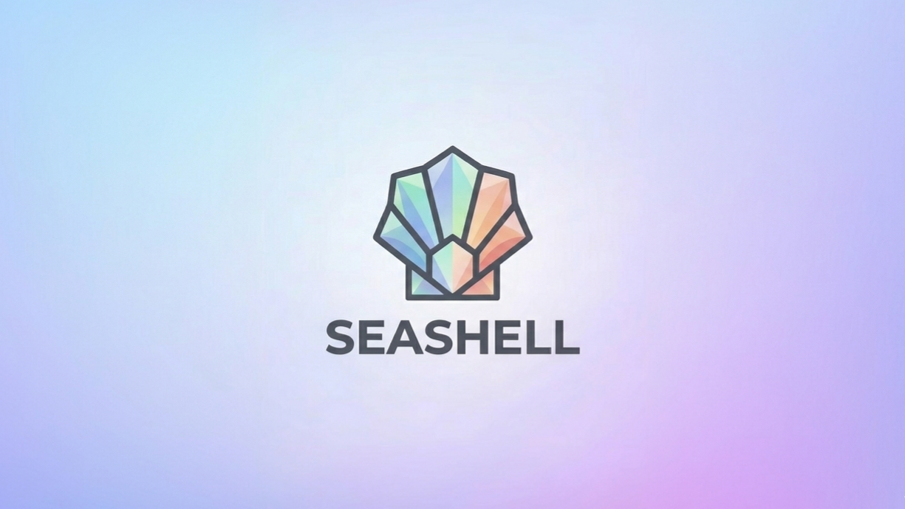

<p align="center">
  
</p>

An cryptocurrency implementation in Go featuring a **Proof of Authority** blockchain, UTXO-based transactions, ECDSA wallets, a REST API with JWT authentication, and a multi-role management system.

---

## Features

- **Proof of Authority consensus** — round-robin ECDSA block signing by registered authority validators (no mining)
- **UTXO transaction model** — unspent output tracking with ECDSA P256 transaction signing
- **REST API server** — chi-based HTTP API with full auth, role-based access control, and authority management
- **JWT authentication** — 15-minute access tokens + 7-day revocable refresh tokens
- **Multi-role system** — `superadmin`, `admin`, `user` system roles; `owner`/`member` authority sub-roles
- **Authority management** — create/approve/suspend authorities, invitation-based membership
- **Support tickets** — per-authority ticket system with admin reply workflow
- **Internal value engine** — Velocity of Money price model: `price = base_price × (1 + k × velocity)`
- **CLI mode** — original command-line interface still fully functional

---

## Build

```bash
make build
# Output: bin/seashell
```

Requires Go 1.18+. Run `make build` the first time — it downloads Go 1.18 locally if needed.

---

## API Server

### Quick Start

**1. Generate secrets**

```bash
cd example
pnpm gen:env
```

This outputs ready-to-paste values for your `.env`:

```
JWT_SECRET='<hex>'
NODE_SECRET='<hex>'
SUPERADMIN_PASSWORD='<alphanumeric+symbols>'
```

Copy the output into a `.env` file at the repo root and fill in the remaining variables (see Configuration below).

**2. Start the server**

```bash
set -a && source .env && set +a
bin/seashell --api
# SeaShell API server listening on :8080
```

The superadmin account (`superadmin@seashell.local`) is created automatically on first start.

### Configuration

| Variable | Default | Description |
|----------|---------|-------------|
| `SUPERADMIN_PASSWORD` | **required** | Superadmin password |
| `SUPERADMIN_EMAIL` | `superadmin@seashell.local` | Superadmin email |
| `PORT` | `8080` | HTTP listen port |
| `JWT_SECRET` | `changeme-secret` | JWT signing secret |
| `DB_PATH` | `./db` | Database directory |
| `ACCESS_TOKEN_MINUTES` | `15` | Access token TTL |
| `REFRESH_TOKEN_DAYS` | `7` | Refresh token TTL |

### API Endpoints

#### Public
```
GET  /api/v1/health
GET  /api/v1/blocks
GET  /api/v1/blocks/{hash}
GET  /api/v1/value
```

#### Auth
```
POST /api/v1/auth/register    {username, email, password}
POST /api/v1/auth/login       {email, password}
POST /api/v1/auth/refresh     {refresh_token}
POST /api/v1/auth/logout      {refresh_token}
GET  /api/v1/auth/me          (JWT required)
```

#### User (JWT required)
```
GET  /api/v1/user/me
PUT  /api/v1/user/me
GET  /api/v1/user/wallet
POST /api/v1/user/wallet
GET  /api/v1/user/transactions
POST /api/v1/user/transactions      {to_address, amount}
GET  /api/v1/user/authority
POST /api/v1/user/authority         {name, description}
POST /api/v1/user/authority/join    {code}
GET  /api/v1/user/tickets
POST /api/v1/user/tickets           {title, description}
GET  /api/v1/user/tickets/{id}
POST /api/v1/user/tickets/{id}/reply  {message}
```

#### Authority Owner (JWT + authority_role=owner)
```
GET    /api/v1/authority/members
DELETE /api/v1/authority/members/{userID}
GET    /api/v1/authority/invitations
POST   /api/v1/authority/invitations
DELETE /api/v1/authority/invitations/{code}
GET    /api/v1/authority/transactions
GET    /api/v1/authority/value
GET    /api/v1/authority/stats
```

#### Admin (JWT + role=admin or superadmin)
```
GET  /api/v1/admin/authority-requests
GET  /api/v1/admin/authority-requests/{id}
POST /api/v1/admin/authority-requests/{id}/approve  {base_price, sensitivity_k}
POST /api/v1/admin/authority-requests/{id}/reject   {reason}
GET  /api/v1/admin/tickets
GET  /api/v1/admin/tickets/{id}
PUT  /api/v1/admin/tickets/{id}     {status}
POST /api/v1/admin/tickets/{id}/reply  {message}
GET  /api/v1/admin/authorities
GET  /api/v1/admin/users
GET  /api/v1/admin/stats
```

#### SuperAdmin (JWT + role=superadmin)
```
GET    /api/v1/superadmin/admins
POST   /api/v1/superadmin/admins              {username, email, password}
DELETE /api/v1/superadmin/admins/{id}
POST   /api/v1/superadmin/authorities/{id}/suspend
POST   /api/v1/superadmin/authorities/{id}/reinstate
GET    /api/v1/superadmin/stats
```

---

## CLI Mode

The original blockchain CLI is still available (runs without the `--api` flag):

```bash
bin/seashell wallet                              # generate wallet
bin/seashell create -a <ADDRESS>                 # initialize chain with genesis block
bin/seashell balance -a <ADDRESS>                # check balance
bin/seashell send -from F -to T -amount N        # send coins
bin/seashell list                                # print all blocks
bin/seashell walletlist                          # list all wallet addresses
bin/seashell addvalidator -a <ADDRESS>           # register a PoA validator
```

> **Note:** Do not run the CLI and API server concurrently — BadgerDB does not support multi-process access to the same files.

---

## Consensus: Proof of Authority

Blocks are signed by registered authority validators in round-robin order (selected by block height). No hash mining is performed.

- Transaction signing: ECDSA P256, `r||s` format
- Block signing: same ECDSA P256, over `SHA256(prevHash || txHash || timestamp || height)`
- Validators are registered on the blockchain when an admin approves an authority request

---

## Tests

```bash
go test ./...
```

Tests cover: auth service (JWT, bcrypt, bootstrap), value calculation, all store CRUD operations, HTTP handlers (register/login, JWT middleware, role enforcement).

---

## Deployment

See [docs/DEPLOYMENT.md](docs/DEPLOYMENT.md) for full deployment instructions including systemd service setup, nginx reverse proxy, and security notes.

---

## Architecture

```
seashell/
├── main.go              # Entry point: --api flag or CLI
├── config/              # ENV-based configuration
├── model/               # Data structs (User, Authority, Ticket, etc.)
├── store/               # BadgerDB persistence layer
├── service/             # Business logic (auth, chain, value engine)
├── api/
│   ├── server.go        # chi router + server bootstrap
│   ├── middleware/      # JWT auth, role enforcement
│   ├── handlers/        # HTTP handler implementations
│   └── response/        # Standardized JSON responses
├── blockchain/          # PoA chain: blocks, transactions, UTXO, validators
├── wallet/              # ECDSA keypairs, address generation
├── cli/                 # Command-line interface
└── docs/                # Deployment documentation
```
